so terraform ek software h jo ki hume infractre baname help karta h

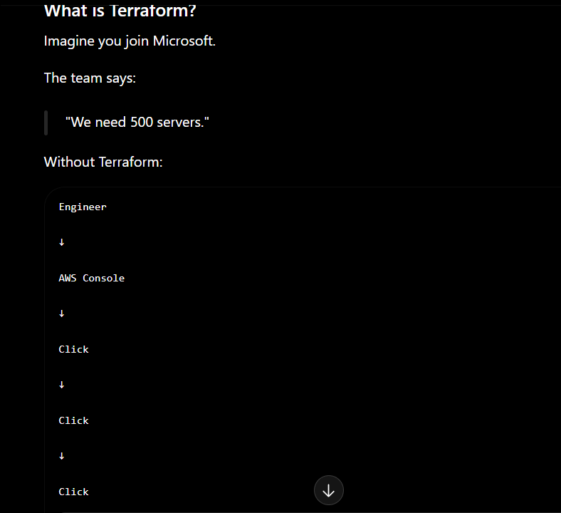

so aise tum click hi karte reh jaoge 

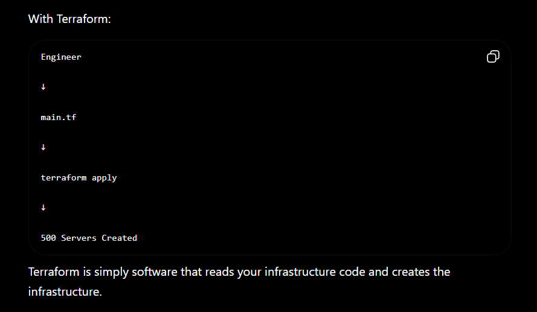

so terraform se tum ek simple code likh skate ho jise terrafom padega aur woh aws ya phir kisis bhi provider se baat karega aur infrastructure is ready

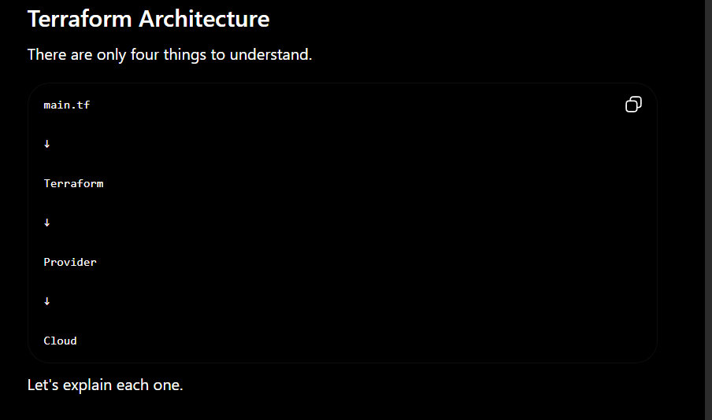

## main.tf

so ise hum hcl m likete h 

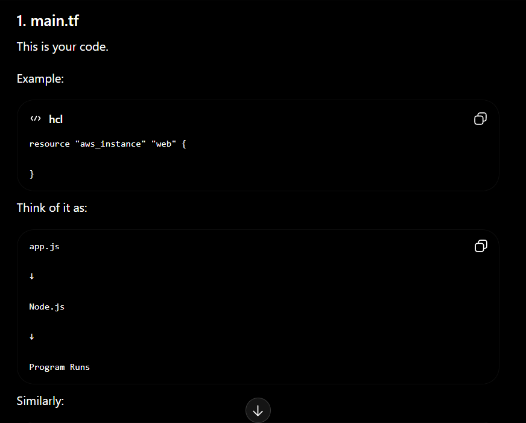

## terraform

so terraform ek just engine h jo ki main.tf ko read karta h aur deicde karta h kya banaa h infrastructure

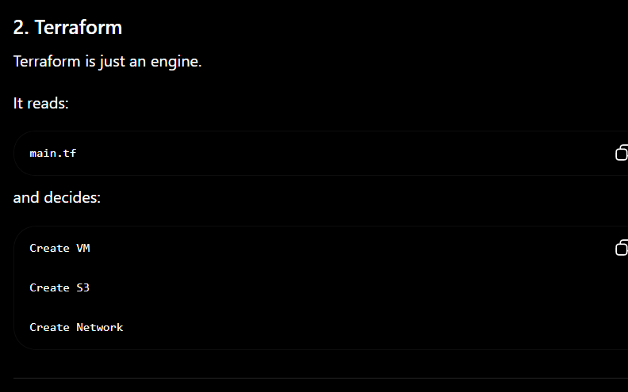

## provider

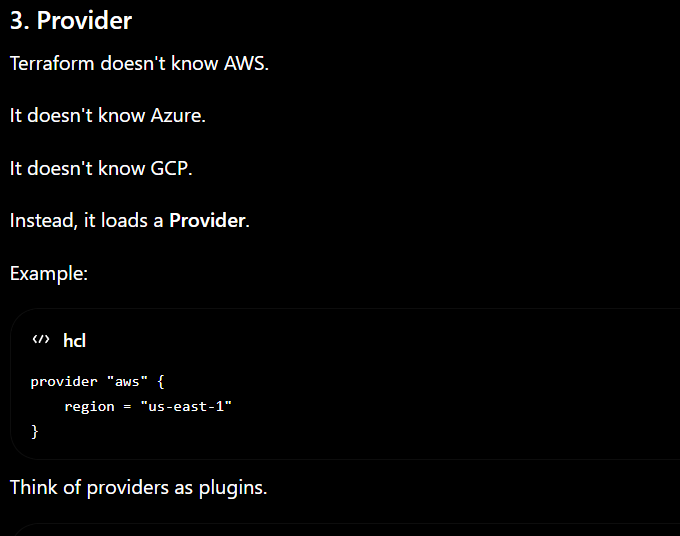

# cloud 

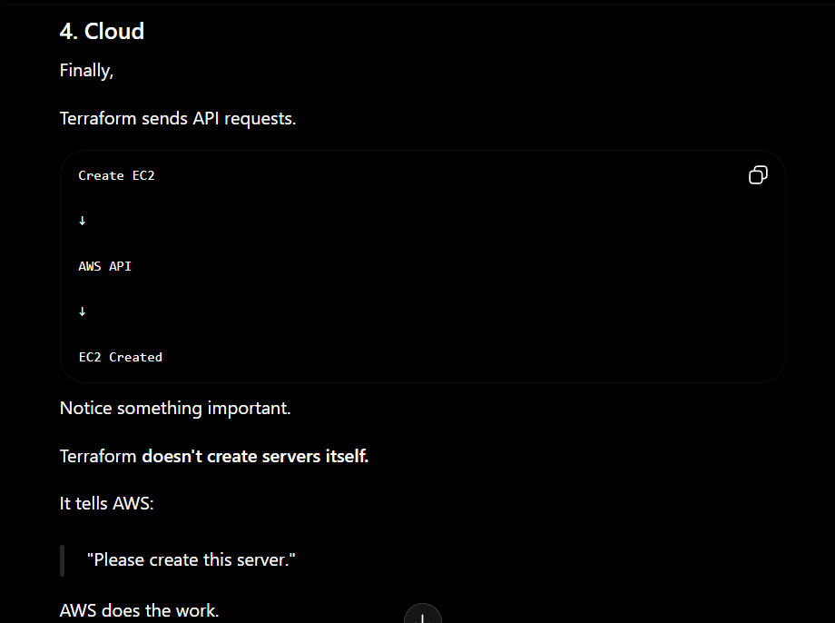

## code

```
terraform {
  required_providers {
  local = {
    source = "hashicorp/local"
    version = "~> 2.5"
  }
}

}

```

so ye code teraform ko batata h ki kya requirment chaiye use run karne se phel like idhar hun local provider liya h so pehel ye local provider downlod karega like that 


so ise run kanr ke liye tum

ye cmd use kr sakte ho

terraform init

so ye nmp install ke jaisa hi h

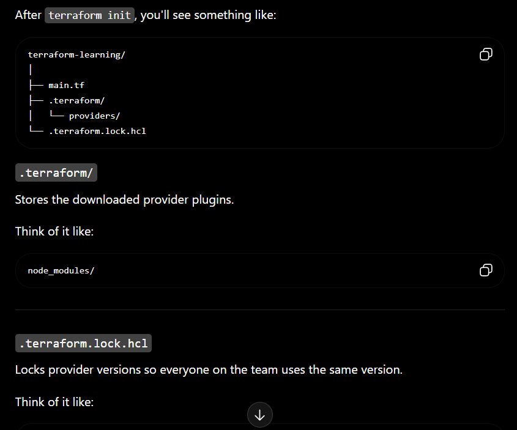


## terraform workflow
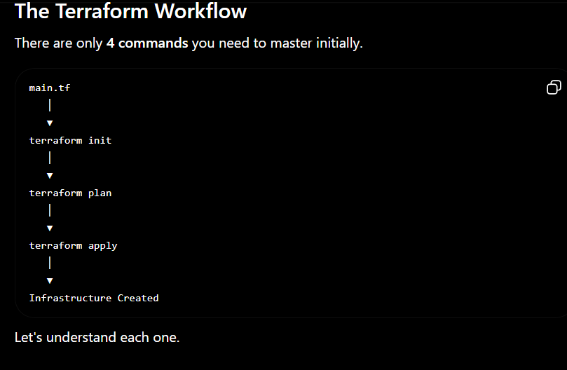

## terraform init

so this is used to prepare the project like npm init so woh sab package json lata h ye bhi .teraform .terraform.lock.hcl create karta h

aur infrasture bhi download karta h

## terraform plan

so ye most important cmd h

so ye batata h agr humen terraform apply kiya toh kya hoga like plan explain karta h infrastructe m koi change nahi karta h but ye batata h ki kya hoga infracsture m jb hum run karege apne code ko 

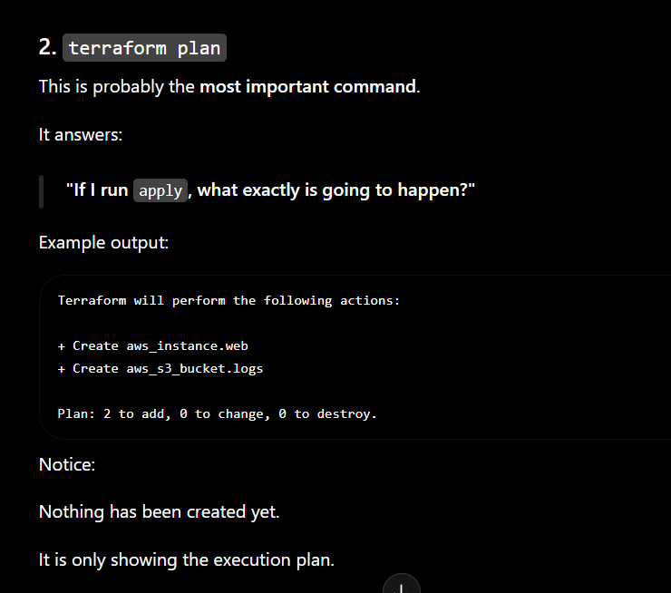

## terraform apply

so is cmd se humara terraform actally provider se baat karta h jise infrastructure  banta h 

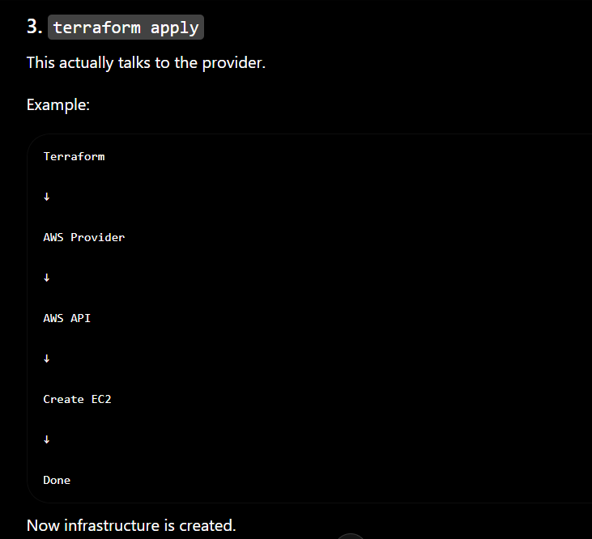

## terraform destroy

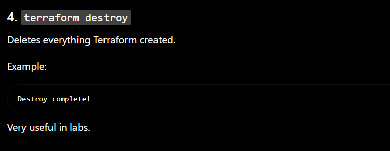


## resouces

so hume pata h terraform infracture banta h but use pata kaise chalta h kya baan so use resource keyword se pata chalta h

so the code look like this

resouce keyword h jo ki use hot h infrastructre define karne ke liye

```
resource "aws_s3_buckek" "images"

```

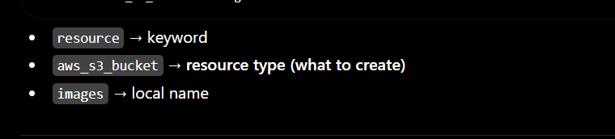


## varible 

so dyncmic data ke liye varible use karte h terraform me

```
variable "filename" {
  default = "hello.txt"
}

resource "local_file" "hello" {
  filename = var.filename
  content  = "Hello Terraform!"
}

```

## outputs

so tume kuch output chaiye terraform se toh tum outputs use kar skate ho so think of this like return or print statemts

so output kar use akrste h hum public ip pane ke liye o newy crearted ho

```
output "public_ip" {
  value = aws_instance.web.public_ip
}

```

## Modules
modules toh simply progremaing wala h jisme hum diffrnet features wah phri woh fucntion jsi hum bar bar use karna chate h use diffrnt file me daal dete the phir use main file se call kr dete the 

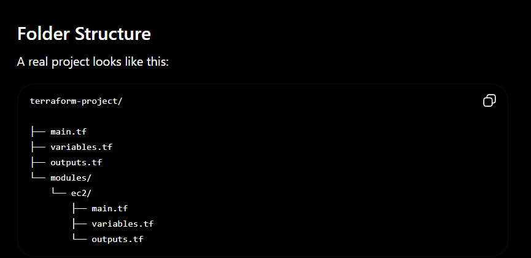

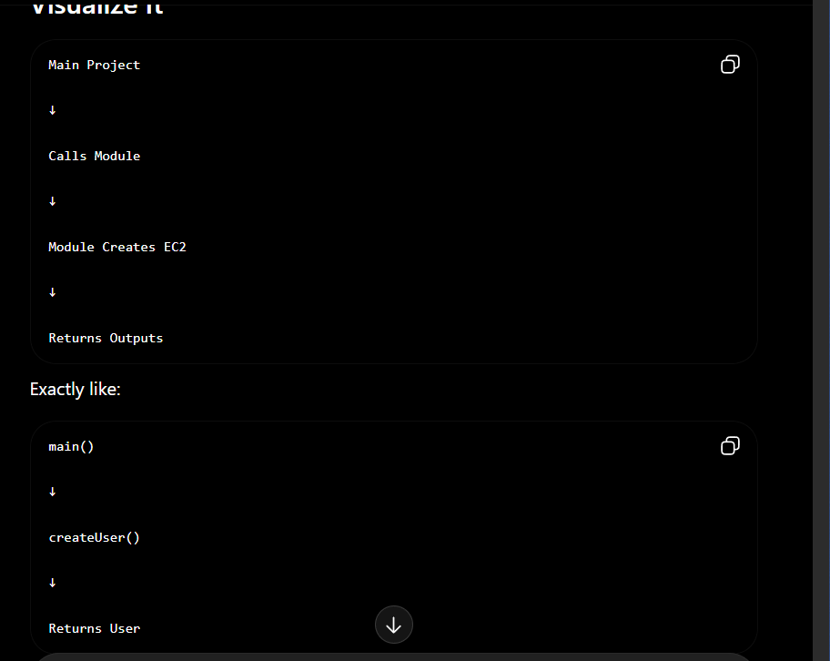

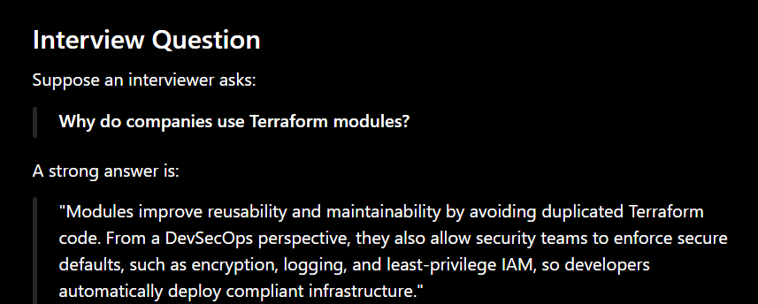
